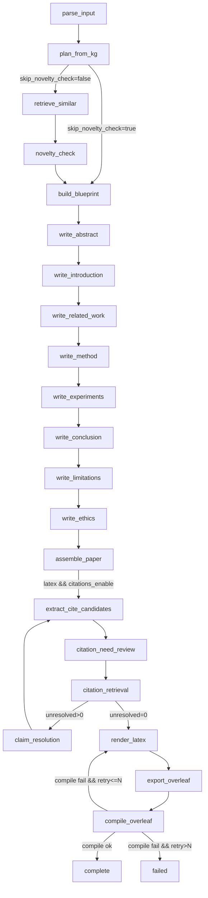

# 论文生成链路（当前默认配置）技术说明

本文档面向需要**理解/调参/排障/二次开发**本项目的人，按“当前默认启用的功能链路”（以仓库根目录 `config_paper.yaml` 为准）对整个端到端流程做一次系统性说明。内容以专业技术文档方式组织，并尽量把“开关 → 行为 → 产物 → 日志”讲清楚。

> 快速入口：CLI 命令 `python -m api.paper_cli workflow ...`  
> 配置文件：`config_paper.yaml`（未传 `--config` 时会自动加载）  
> 工作流实现：`workflow/paper_controller.py`（LangGraph 状态机）

---

## 1. 默认配置的“启用链路”概览

当前 `config_paper.yaml` 的关键开关（只列出会改变链路分支的部分）：

- 输出形态：`output_format: latex`  
  含义：走 LaTeX 导出/编译闸门，产出 Overleaf 工程（`outputs/overleaf/.../overleaf.zip`）。

- LaTeX 渲染：固定 Pandoc  
  含义：章节写作阶段主要生成 Markdown（当前为 spec 后端），在 `render_latex` 节点统一渲染成 LaTeX；本地必须能运行 `pandoc`（可用环境变量 `PANDOC_BIN` 覆盖路径）。

- 引用链路：`citations_enable: true`  
  含义：会执行“抽取引用候选 → 判断是否需要引用 → 检索/生成 refs.bib → unresolved 则改写 claim 并回圈”。  
  检索工具固定为 Mock（无外网请求），适合离线/演示；但**仍可能需要 LLM 做候选选择与格式化**（取决于 `--use-llm`）。

- 查重（novelty）链路：`skip_novelty_check: true`  
  含义：跳过 embedding/vector store 构建与 novelty 检索；工作流将直接从 `plan_from_kg` 进入 `build_blueprint`。

- 英文质量闸门：`enforce_english: true` 且 `max_cjk_ratio: 0.01`  
  含义：章节 Markdown 会进行“中文比例”检查，不达标会触发质量重写回路（你之前日志里出现的 `non_english_ratio_high` 就来自这里）。

- Markdown 质量闸门：`strict_markdown_validation: true`  
  含义：章节输出如果格式/结构/字数等不合格，会触发额外重写/修复；在无 LLM 时可能直接失败或回退兜底（取决于具体节点与开关）。

- Overleaf 模板：`latex_template_preset: colm2024_conference`  
  以及首页样式：`latex_titlepage_style: agentalpha`  
  含义：导出的 `main.tex` 使用 COLM 模板，首页标题盒子采用 AgentAlpha 风格（tcolorbox），但页眉页脚仍保持 COLM/fancyhdr 风格。

---

## 2. 工程结构与核心模块

### 2.1 目录结构（与职责）

- `api/`
  - `api/paper_cli.py`：CLI 入口（加载 `.env`、读取 config、创建各 agent、启动工作流）。
  - `api/web_server.py`：Web UI 入口（可选）。

- `workflow/`
  - `workflow/paper_controller.py`：**工作流状态机**（LangGraph），定义节点、路由、重试与回退策略。

- `paper_kg/`
  - `paper_kg/input_parser.py`：解析用户输入（抽取 core idea + domain）。
  - `paper_kg/orchestrator.py`：写故事骨架、选择套路、生成 draft 等（含 `PaperDraftWriter`）。
  - `paper_kg/paper_template.py` / `paper_kg/paper_plan_builder.py`：从模板生成 `PaperPlan`。
  - `paper_kg/section_writer.py`：逐章写作（结构化输出 → 校验 → 重写/兜底）。
  - `paper_kg/citations/*`：引用抽取、必要性审阅、检索、claim 改写。
  - `paper_kg/pandoc_latex_renderer_agent.py`：Pandoc LaTeX 渲染与修复。
  - `paper_kg/latex_toolchain.py`：本地编译闸门（latexmk）。
  - `paper_kg/overleaf_project.py`：导出 Overleaf 工程与打包 zip。
  - `paper_kg/latex_templates/*`：导出的 `main.tex` 模板集合。

- `core/`
  - `core/config.py`：配置结构与 YAML 读取。
  - `core/llm.py`：从环境变量创建 ChatOpenAI（支持每个 agent 单独覆盖）。
  - `core/embeddings.py`：从环境变量创建 Embedding 模型（当不跳过 novelty 时才需要）。

- `prompts_paper/` / `prompts_paper_en/`
  - 论文链路提示词目录；CLI 会根据 `paper_language` 自动选择并设置 `PAPER_PROMPT_DIR`。

---

## 3. 端到端执行入口（CLI）

### 3.1 CLI 主命令

端到端工作流：

```bash
python -m api.paper_cli workflow "一句话论文想法" --config config_paper.yaml --snapshot-path knowledge_graph.json
```

关键参数：
- `--config`：配置文件路径；不传时会自动加载根目录 `config_paper.yaml`（如果存在）。
- `--snapshot-path`：图谱快照；不传时默认：
  - 若根目录有 `knowledge_graph.json` 则优先使用；
  - 否则使用 `paper_kg_snapshot.json`（不存在会自动生成 mock 快照）。
- `--use-llm/--no-use-llm`：是否启用真实 LLM（默认启用）。
- `--use-mock-embedding`：仅在需要构建 embedding 时用于离线测试（当 `skip_novelty_check: false` 才会走到 embedding）。
- `--seed`：覆盖随机种子（便于复现）。

### 3.2 `.env` 的加载与 agent 级覆盖

CLI 会调用 `core/llm.py::load_env()` 自动加载 `.env`。LLM/Embedding 的参数读取规则：
- 优先读取 `PREFIX_OPENAI_*`（agent 级覆盖）
- 没有则回退读取全局 `OPENAI_*`

例如章节写作 agent 名称是 `paper_section_writer`，其前缀是 `PAPER_SECTION_WRITER_`。

---

## 4. 工作流状态机（LangGraph）结构

### 4.1 节点列表（与代码实现）

工作流在 `workflow/paper_controller.py::_build_graph()` 注册节点：

1) 解析与计划：
- `parse_input`
- `plan_from_kg`
- `retrieve_similar`（本配置下会被跳过）
- `novelty_check`（本配置下会被跳过）
- `build_blueprint`

2) 逐章写作（固定顺序）：
- `write_abstract`
- `write_introduction`
- `write_related_work`
- `write_method`
- `write_experiments`
- `write_conclusion`
- `write_limitations`
- `write_ethics`

3) 拼接与引用：
- `assemble_paper`
- `extract_cite_candidates`
- `citation_need_review`
- `citation_retrieval`
- `claim_resolution`（当 unresolved citations 存在时启用回圈）

4) LaTeX 与导出：
- `render_latex`
- `export_overleaf`
- `compile_overleaf`

### 4.2 当前默认配置下的实际路径（主链路）

因为当前配置：
- `skip_novelty_check: true`
- `output_format: latex`
- `citations_enable: true`

因此，本仓库在“默认配置”下的**理想主路径**（不考虑重试/回退回圈）是：

`parse_input → plan_from_kg → build_blueprint → write_*（8 章）→ assemble_paper → extract_cite_candidates → citation_need_review → citation_retrieval → render_latex → export_overleaf → compile_overleaf → complete`

同时存在 2 类非常关键的“回圈”：

1) **引用回圈**：`citation_retrieval` 有 unresolved → `claim_resolution` 降级改写 → 回到 `extract_cite_candidates` 重新跑一轮引用抽取/检索（最多 `citations_max_rounds` 次）。
2) **LaTeX 修复回圈**：`compile_overleaf` 失败且 `latex_format_retry <= latex_format_max_retries` → 回到 `render_latex` 进入 fix_mode（根据编译日志做针对性修复）。
下面用一张图把“实际会发生的路径”画清楚。

#### 4.2.1 流程图（含分支与回圈）

> 提示：看运行日志时，优先抓 `PAPER_ROUTE:` 行，它会告诉你当下为什么从 A 节点跳到 B 节点。



#### 4.2.2 关键路由条件（和配置的对应关系）

这部分非常重要：你改 config 的时候，本质上是在改变这些 if/route。

- `skip_novelty_check: true`
  - 代码位置：`workflow/paper_controller.py::_plan_from_kg_node()`
  - 行为：`plan_from_kg` 直接路由到 `build_blueprint`（日志：`PAPER_ROUTE: plan_from_kg -> build_blueprint (skip_novelty_check)`），不会构建/查询向量库，也不会做 novelty 判定。

- `output_format: latex`
  - 代码位置：`workflow/paper_controller.py::_post_assemble_route()`
  - 行为：`assemble_paper` 之后不会立刻 `export_overleaf`，而是先走 `render_latex`（以及可选的 citations 链路）。

- `citations_enable: true`（且 `output_format=latex`）
  - 代码位置：`workflow/paper_controller.py::_post_assemble_route()`
  - 行为：`assemble_paper` 后进入 `extract_cite_candidates`，而不是直接 `render_latex`。
  - 你在日志里看到的 `PAPER_CITATION_EXTRACT_* / PAPER_CITATION_NEED_* / PAPER_CITATION_RETRIEVE_*` 都来自这条链路。

---

## 5. 工作流状态数据（PaperWorkflowStateData）与持久化

工作流本质是一个“不断读写 state 的状态机”。所有节点都只做两件事：

1) 从 `state` 读输入；
2) 写回部分字段（LangGraph 会合并更新）。

状态结构定义在：`workflow/paper_controller.py` 的 `PaperWorkflowStateData`。

### 5.1 字段分组速查（你排障时要知道看哪里）

**A. 输入解析相关**

- `user_input`：用户原始一句话输入
- `core_idea` / `domain`：LLM/规则解析后的核心 idea 与领域
- `idea_id` / `domain_id`：在 KG 中匹配到的节点 id（匹配不到会走 fallback）

**B. 选套路 / 写作指导相关**

- `candidate_pattern_ids` / `candidate_pattern_scores`：候选套路与分数（用于多样性采样/降权）
- `selected_patterns` / `selected_tricks`：最终选中的套路/技巧
- `pattern_guides`：把 patterns/tricks 整理成“写作指导”的文本（给 section writer 用）

**C. 论文计划与章节输出**

- `paper_plan`：`PaperPlan`（章节顺序、required points、目标字数等）
- `paper_sections`：每章的 `PaperSectionOutput`（包含 `content_markdown/content_latex/summary/todo/...`）
- `section_summaries`：每章摘要，作为后续章节的“依赖摘要”输入
- `rewrite_targets`：需要重写的章节 id 列表（默认空）

**D. 引用链路**

- `citation_candidates`：从 Markdown 里抽取到的引用候选点（带 candidate_id）
- `citation_needs`：对每个候选点判定 HARD/SOFT/NONE 的需求（含 year_range）
- `citation_results`：检索后的结果（FOUND/NOT_FOUND + bibtex/bibkey/evidence）
- `unresolved_citations`：没检索到的 candidate_id 列表
- `refs_bib_text`：最终写入 `refs.bib` 的 BibTeX 内容
- `citations_report`：导出时会额外写成 `citations_report.json`（便于审计/排障）

**E. LaTeX 导出/编译闸门**

- `paper_latex`：整篇 LaTeX（`render_latex` 输出）
- `overleaf_project_dir` / `overleaf_zip_path`：导出目录与 zip 路径
- `latex_compile_report`：latexmk 编译摘要（ok/stderr/stdout/errors/log_excerpt）
- `latex_format_retry`：全量编译失败后的“仅格式修复”重试次数

**F. 计数器与终止条件**

- `plan_retry` / `draft_attempts`
- `warnings`：非致命告警（会出现在 step log）
- `status`：PASS/FAILED/…
- `next_step`：路由中转字段（决定下一节点）

### 5.2 `draft` 字段：为什么 CLI 最后能打印完整报告

`draft`（类型 `paper_kg.models.StoryDraft`）是对 state 的“面向 UI/输出的镜像”，用于：

- CLI 最后输出 JSON 报告（`PaperWorkflowReport`）
- Web UI/SSE 展示中间过程
- 把导出的 `overleaf_project_dir/zip_path/latex_compile_report` 一并带出来

它不是单独持久化存储，只是 state 的一个聚合副本；每个节点在写 state 时都会尽量同步更新 draft。

---

## 6. 节点级“点对点说明”（默认链路）

本节按默认链路的真实执行顺序，逐节点说明：

- 做什么
- 读写哪些 state 字段
- 受哪些 config 影响
- 典型日志 & 失败模式

### 6.1 `parse_input`：解析一句话输入

- 代码位置：`workflow/paper_controller.py::_parse_input_node()`
- 输入：`state.user_input`
- 输出（写回 state）：
  - `core_idea`：核心 idea（用于匹配 KG 的 Idea）
  - `domain`：领域 hint（CV/NLP/…）
  - `idea_id` / `domain_id`：匹配到的 KG 节点 id（匹配不到会 fallback）
- 关键日志：`PAPER_PARSE_*`
- 常见问题：
  - 如果你的 KG 的 Domain.name 是中文（例如“自然语言处理”），这里有一层中文关键词匹配（见 `workflow/paper_controller.py::_resolve_domain_id()`）。

### 6.2 `plan_from_kg`：选套路/采样/（可选）查重入口

- 代码位置：`workflow/paper_controller.py::_plan_from_kg_node()`
- 输入：
  - `idea_id/domain_id`（用于从 KG 拉 patterns/skeleton/tricks）
  - `config.max_patterns/temperature/penalty/retriever_top_k/...`
- 输出：
  - `selected_patterns/selected_tricks/pattern_guides`
  - `paper_plan`（还没有章节正文）
- 与当前配置的关系：
  - `skip_novelty_check: true` 时：`plan_from_kg` 直接路由到 `build_blueprint`。
  - `skip_novelty_check: false` 时：会继续走 `retrieve_similar → novelty_check` 并可能触发“降权重采样”。
- 关键日志：
  - `PAPER_ROUTE: plan_from_kg -> build_blueprint (skip_novelty_check)`

### 6.3 `build_blueprint`：把“套路”落到章节级计划

- 代码位置：`workflow/paper_controller.py::_build_blueprint_node()`
- 输入：`selected_patterns/selected_tricks` + 模板文件 `template_path`
- 输出：`paper_plan`（包含 8 个章节的 section_id/title/required_points/target_words_min/...）
- 与配置的关系：
  - `template_path: paper_template_en.yaml`：决定章节集合、顺序、每章的 required points。
  - `enable_related_work: true`：相关工作章节是否启用（模板也可能决定）。
- 关键日志：`PAPER_BLUEPRINT_*`

### 6.4 `write_*`：逐章写作（Markdown/spec 后端 + 英文质量闸门）

这一段是链路里最“长”的部分；当前配置：

- `markdown_writer_backend: spec`
- `output_format: latex`（此阶段主要产出 Markdown）
- `enforce_english: true` 且 `max_cjk_ratio: 0.01`
- `strict_markdown_validation: true`

#### 6.4.1 写作后端：`spec` 是什么

- 代码位置：`paper_kg/section_writer.py::PaperSectionWriter`
- 核心思想：
  - LLM 不直接“排 Markdown”，而是输出结构化 `content_spec`（JSON）
  - 系统用确定性渲染器把 spec 渲染成 Markdown：`paper_kg/markdown_renderer.py::render_section_markdown()`
- 这样做的收益：
  - 更稳定的标题/列表/公式/代码块结构
  - 更容易插入稳定的引用标记（`[[CITE]]`）

#### 6.4.2 为什么会反复出现 `non_english_ratio_high`

- 触发点：`paper_kg/section_writer.py::_validate_markdown_output()`
- 条件：
  - `enforce_english: true`
  - `paper_language: en`
  - 章节正文（去掉 Markdown 语法后）中文比例 `> max_cjk_ratio`
- 现象（你看到的日志）：
  - `SECTION_MARKDOWN_INVALID: id=abstract issues=['non_english_ratio_high:0.858>0.01'] ...`
  - 然后进入质量重写回路：`SECTION_QUALITY_REWRITE_START` / `SECTION_QUALITY_REWRITE_VALIDATE_FAIL`
- 解决方式（按推荐顺序）：
  1) **你要写中文论文**：把 `paper_language` 改为 `zh`，或把 `enforce_english: false`
  2) 你要英文，但允许少量中文术语：把 `max_cjk_ratio` 提高（例如 `0.02` 或 `0.05`）
  3) 优化 prompt：在 `prompts_paper_en/` 的写作提示词中明确“禁止中文”

#### 6.4.3 Markdown 质量闸门：为什么会触发“质量重写”

- 触发点：`paper_kg/section_writer.py::_validate_markdown_output()`
- 典型检查项：
  - 顶层标题缺失/不一致（`missing_top_level_heading` / `heading_title_mismatch`）
  - 字数不足（`word_count_below_min:x<y`，由 `section_min_word_ratio` 与模板 target_words_min 决定）
  - 英文比例不达标（`non_english_ratio_high`）
- 当 `strict_markdown_validation: true`：
  - 会优先走“质量修复重写”回路（`rewrite_section_quality_system.txt`）
  - 如果 LLM 不可用且仍不达标，会 fail-fast（抛异常）

#### 6.4.4 每章写作的输入输出（你排障时看这些）

- 输入（喂给 LLM 的核心内容）：
  - `section_plan`：本章计划（required points/目标字数/依赖）
  - `prior_summaries`：依赖章节摘要（例如 method 可能依赖 introduction）
  - `pattern_guides`：套路+技巧写作指导
- 输出（写回 state）：
  - `paper_sections[i].content_markdown`：规范化后的 Markdown
  - `paper_sections[i].summary`：本章摘要（长度由 `section_summary_max_chars` 控制）
- 关键日志：
  - `SECTION_WRITE_LLM_START`
  - `SECTION_MARKDOWN_INVALID`
  - `SECTION_QUALITY_REWRITE_*`
  - 最终在 controller 层会打印每章摘要：`PAPER_SECTION: id=...`

### 6.5 `assemble_paper`：拼接整篇 Markdown

- 代码位置：`workflow/paper_controller.py::_assemble_paper_node()`
- 输入：
  - `paper_plan.sections` 顺序
  - `paper_sections`（逐章输出）
- 输出：
  - `paper_markdown`：拼接后的全文 Markdown
  - `draft.paper_markdown` 同步更新
- 路由关键点（当前配置）：
  - 因为 `output_format=latex` 且 `final_only` 且 `citations_enable=true`，所以 assemble 后会进入 `extract_cite_candidates`（见 `_post_assemble_route()`）。

### 6.6 引用链路：从 `[[CITE]]` 到 `refs.bib`

引用链路的目标：生成 **可编译** 的 `refs.bib`，并尽可能让引用可验证（doi/arxiv/url）。

#### 6.6.1 `extract_cite_candidates`：从 Markdown 抽取候选点

- 代码位置：`paper_kg/citations/extractor.py` + `workflow/paper_controller.py::_extract_cite_candidates_node()`
- 输入：各章 Markdown（内部会扫描 `<!-- CITE_CANDIDATE:... -->` 标记）
- 输出：
  - 更新后的 Markdown（补齐 candidate_id 的 marker）
  - `citation_candidates`：候选点列表（包含上下文、claim 文本等）
- 关键日志：`PAPER_CITATION_EXTRACT_*`

#### 6.6.2 `citation_need_review`：判定是否“必须引用”

- 代码位置：`paper_kg/citations/need_reviewer.py` + `workflow/paper_controller.py::_citation_need_review_node()`
- 输入：`citation_candidates`
- 输出：`citation_needs`（need_type=HARD/SOFT/NONE + year_range）
- 关键日志：`PAPER_CITATION_NEED_OK`

#### 6.6.3 `citation_retrieval`：检索并生成 bibtex（含 5s 延时）

- 代码位置：
  - 控制器节点：`workflow/paper_controller.py::_citation_retrieval_node()`
  - LLM 检索 agent：`paper_kg/citations/retrieval_agent.py::CitationRetrievalAgent`
- 当前默认行为（`--use-llm` 时）：
  - 会启用 `CitationRetrievalAgent`
  - 检索工具固定为 Mock（无外网请求），但**仍会调用 LLM 生成 query 和做候选选择**
- 你要求的“每次请求加延时”已落地在：
  - `paper_kg/citations/retrieval_agent.py` 的 `_LLM_CALL_DELAY_SEC = 5.0`
  - 每次 `llm.invoke(...)` 前都会 `time.sleep(5.0)`，用于降低 RPM 触发概率
- 输出：
  - `citation_results`：FOUND/NOT_FOUND 的结果
  - `refs_bib_text`：拼接好的 BibTeX
  - `unresolved_citations`：没命中的 candidate_id
  - `citations_report`：用于导出审计（会写入 `citations_report.json`）
- 关键日志：`PAPER_CITATION_RETRIEVE_DONE`

#### 6.6.4 `claim_resolution`：引用找不到时的降级策略（回圈）

- 代码位置：`workflow/paper_controller.py::_claim_resolution_node()`
- 输入：`unresolved_citations` + 当前全文 Markdown/sections
- 行为：
  - 把“必须引用但找不到”的 claim 做降级改写（例如改成更保守的陈述，或移除具体数字结论）
  - 然后回到 `extract_cite_candidates` 重新跑引用链路
- 终止条件：超过 `citations_max_rounds` 会 `FAILED`

### 6.7 `render_latex`：Pandoc 渲染（最终排版工）

- 代码位置：
  - 控制器节点：`workflow/paper_controller.py::_render_latex_node()`
  - 渲染 agent：`paper_kg/pandoc_latex_renderer_agent.py::PandocLatexRendererAgent`
- 当前默认配置：
  - Pandoc 必须存在（可用 `PANDOC_BIN` 覆盖路径）
  - `pandoc_consistency_threshold: 0.0`（几乎不做一致性拦截）
  - `pandoc_fail_on_content_loss: false`（发现内容丢失时回退而非直接失败）
- 输入：
  - `paper_sections[*].content_markdown`
  - `citation_results`（用于把候选 marker 替换成 `\\cite{bibkey}`）
- 输出：
  - `paper_sections[*].content_latex`
  - `paper_latex`（拼接后的 LaTeX）
- Abstract 特判（非常关键）：
  - `paper_kg/pandoc_latex_renderer_agent.py`：abstract 章节不会包 `\\section{}`，只输出正文 LaTeX（因为主文件会用 abstract 环境或 titlebox 包住）
- fix_mode（当 compile_overleaf 失败时触发）：
  - `compile_overleaf` 失败会把 `latex_format_retry` +1，并把 next_step 设为 `render_latex`
  - `render_latex` 检测到 `fix_mode=True` 时，会调用 `PandocLatexRendererAgent.fix_sections(...)`，把编译日志喂给 LLM 做针对性修复（可按章节 targets 修）

### 6.8 `export_overleaf`：写出工程目录与 zip

- 代码位置：`paper_kg/overleaf_project.py::build_overleaf_project()`
- 输出目录：
  - 默认 `latex_output_dir: ./outputs/overleaf`
  - run_id 自动生成，例如：`outputs/overleaf/paper_4687332690/`
- 产物结构（重点文件）：
  - `main.tex`：入口（完全由系统模板渲染，LLM 不参与导言区）
  - `sections/*.tex`：每章 LaTeX（由 render_latex 产出）
  - `refs.bib`：引用库（来自 citations 链路或占位生成）
  - `citations_report.json`：引用审计报告（如果 citations_report 存在）
  - `colm2024_conference.sty/.bst` + `logo/*`：COLM 资产（preset=colm 时会复制）
  - `overleaf.zip`：上述文件的打包

### 6.9 `compile_overleaf`：全量编译闸门（latexmk）

- 代码位置：`workflow/paper_controller.py::_compile_overleaf_node()` + `paper_kg/latex_toolchain.py`
- 当前默认配置：
  - `latex_require_tools: true`：缺工具直接报错（fail fast）
  - `latex_engine: xelatex`
  - `latex_compile_timeout_sec: 120`
  - `latex_format_max_retries: 3`：失败最多触发 3 次“render_latex fix_mode”重试
- 为什么你看到 `inconsolata.sty not found`：
  - `colm2024_conference.sty` 里 `\\RequirePackage{inconsolata}`（字体包）
  - 本机 TeXLive 缺 `inconsolata`（通常装 `texlive-fonts-extra` 即可）
- 输出：
  - `latex_compile_report`（ok/stdout/stderr/log_excerpt/errors/cmd）
  - 失败时会附加 `warnings` 并设置 `next_step=render_latex`（进入修复回圈）

## 7. 输出产物与目录布局（默认链路）

### 7.1 `outputs/logs/`：运行日志（强烈建议保留）

- 控制台日志：由 `logging.basicConfig(...)` 输出
- step-summary 日志（你在 IDE 里打开的那种）：
  - 由 `core/logging.py::add_step_summary_file_handler()` 创建
  - 默认路径：`outputs/logs/paper_workflow_steps_YYYYMMDD_HHMMSS.log`
  - 只过滤保留关键事件（`PAPER_* / SECTION_* / PANDOC_* / OVERLEAF_*` 等）

### 7.2 `outputs/overleaf/<run_id>/`：Overleaf 工程目录

示例结构（不同模板会多/少一些文件，但核心一致）：

```text
outputs/overleaf/paper_<id>/
  main.tex
  refs.bib
  citations_report.json           # 若 citations_enable=true
  colm2024_conference.sty         # preset=colm2024_conference 才有
  colm2024_conference.bst         # preset=colm2024_conference 才有
  logo/
    qwen-logo.pdf                 # COLM 资产（必需）
    hf-logo.pdf
    modelscope-logo.pdf
    github-logo.pdf
    agentalpha-logo.png           # titlepage_style=agentalpha 才有
  sections/
    abstract.tex
    introduction.tex
    related_work.tex
    method.tex
    experiments.tex
    conclusion.tex
    limitations.tex
    ethics.tex
  overleaf.zip
```

你做端到端验收时，建议优先检查：

- `main.tex` 是否包含正确模板/首页逻辑（见第 8 节）
- `sections/abstract.tex` **不应包含** `\\section{Abstract}`（见第 8.4）
- `refs.bib` 是否非空且 bibkey 合法

---

## 8. LaTeX 模板系统（COLM preset + AgentAlpha 首页风格）

### 8.1 preset 选择：`latex_template_preset`

代码位置：`paper_kg/overleaf_project.py::_render_main_tex()`

- `article_ctex`（默认兼容旧链路）
  - 模板文件：`paper_kg/latex_templates/article_ctex/main.tex.template`
  - 特点：ctex + 最小导出，适合中文论文/通用草稿

- `colm2024_conference`（Qwen/COLM 模板）
  - 模板目录：`paper_kg/latex_templates/colm2024_conference/`
  - 会额外复制 assets（`.sty/.bst/logo/`），并强制 `\\bibliographystyle{colm2024_conference}`

### 8.2 首页风格：`latex_titlepage_style`

代码位置：`paper_kg/overleaf_project.py::_render_main_tex()`

当 `latex_template_preset=colm2024_conference` 时：

- `latex_titlepage_style: qwen`
  - 模板文件：`paper_kg/latex_templates/colm2024_conference/main.tex.template`
  - 首页结构：
    - `\\maketitle`
    - `\\begin{abstract} \\input{sections/abstract.tex} \\end{abstract}`
    - （三行链接表格由 `colm2024_conference.sty` 的 `\\maketitle` 内部定义）

- `latex_titlepage_style: agentalpha`
  - 模板文件：`paper_kg/latex_templates/colm2024_conference/main_agentalpha.tex.template`
  - 首页结构：
    - 通过 `tcolorbox` 覆盖 `\\@maketitle`，把 `title/author/links/abstract/date` 放入一个标题盒子
    - 仍然使用 `\\usepackage{colm2024_conference}`（版芯/字体/参考文献样式保持 COLM）
    - 仍然使用 COLM 的 `fancyhdr` 页眉页脚样式，但把 firstpage 的左上角 logo 改为 `logo/agentalpha-logo.png`
    - 三行链接表格居中插在 `author` 与 `abstract` 之间，三行图标仍使用 COLM 提供的官方图标（hf/modelscope/github）

### 8.3 资源复制与“fail fast”

代码位置：`paper_kg/overleaf_project.py::_copy_colm_assets()` / `_copy_agentalpha_logo()`

当 preset=colm 时，导出时会检查并复制：

- 来自 `latex_template_assets_dir` 的：
  - `colm2024_conference.sty`
  - `colm2024_conference.bst`
  - `logo/qwen-logo.pdf`
  - `logo/hf-logo.pdf`
  - `logo/modelscope-logo.pdf`
  - `logo/github-logo.pdf`
- 当 style=agentalpha 时，还会复制：
  - 仓库内 `AgentAlpha_template/logo.png` → 导出工程 `logo/agentalpha-logo.png`

任何缺失都会直接 `raise RuntimeError`（避免“看似套模板，实际没套上”）。

### 8.4 Abstract 为什么不能是 `\\section{Abstract}`

原因：COLM 模板（无论 qwen 还是 agentalpha）都在第一页用“抽象环境/标题盒子”包住 abstract：

- qwen：`\\begin{abstract} ... \\end{abstract}`
- agentalpha：标题盒子里直接 `\\input{sections/abstract.tex}`

所以 `sections/abstract.tex` 的内容必须是“纯正文”，不能再包一层 `\\section{...}`，否则会出现：

- 标题重复
- 目录/编号异常
- 版式不一致

这一点在 3 个地方做了特判兜底：

- `paper_kg/pandoc_latex_renderer_agent.py`：abstract 不包 `\\section`
- `paper_kg/latex_renderer.py`：fallback 渲染器同样 abstract 不包 `\\section`
- `paper_kg/overleaf_project.py::_placeholder_section()`：abstract 的占位也不包 `\\section`

---

## 9. 常见故障与排障手册（按你遇到过的案例整理）

### 9.1 `non_english_ratio_high` 反复重写

见 6.4.2。核心就是“英文质量闸门”被触发：

- 你写中文但 `paper_language: en`/`enforce_english: true`
- 或 prompt 不够强制导致模型输出中文

建议先按业务目标改 config，再考虑调 prompt。

### 9.2 `openai.PermissionDeniedError: 403 - RPM limit exceeded`

这是**模型侧的速率/权限限制**，不是代码 bug。你日志里堆栈显示出错点在：

- `paper_kg/citations/retrieval_agent.py` 的 `llm.invoke(...)`

可选处理方案：

1) 账户侧：完成 identity verification（OpenAI 报错信息已说明）
2) 模型侧：换到你有更高额度/更高 RPM 的 OpenAI-compatible 服务（通过 `.env` 的 `OPENAI_BASE_URL/OPENAI_API_KEY` 或 agent 前缀覆盖）
3) 代码侧：当前已加 `5s` 延时降低触发概率；若仍频繁触发，只能进一步降低调用量（例如关掉 citations 链路或降低检索候选规模）

### 9.3 `Missing input file 'inconsolata.sty'`

原因：COLM 模板依赖 `inconsolata` 字体包（`colm2024_conference.sty` 强制 RequirePackage）。

WSL/Ubuntu 修复（推荐）：

```bash
sudo apt-get update
sudo apt-get install -y texlive-fonts-extra
```

### 9.4 “引用看起来没有跳转 / PDF 没有绿色框”

COLM 模板默认：

- `\\RequirePackage{hyperref}`
- `\\hypersetup{colorlinks=true, citecolor=darkblue, linkcolor=darkblue, urlcolor=darkblue}`

因此 **不会显示绿色/彩色边框**（因为 `colorlinks=true`），而是用“深蓝色文字”表示可点击链接。你可以用两种方式确认链接存在：

1) 在 PDF 里用鼠标点 citation（会跳到 bibliography）
2) 在 PDF 阅读器里开启“显示链接边框/高亮链接”

如果你强烈想要“框”，需要把 `colorlinks` 改为 `false`（不建议改动模板原始风格；如果要改，建议在 `main.tex` 里 override `\\hypersetup`）。

### 9.5 Pandoc 不存在导致 render_latex 失败

Pandoc 是必需依赖，本机必须能跑 `pandoc`。修复：

- 安装 pandoc（见 `README.md` 的系统依赖章节）

---

## 10. 二次开发/扩展点（面向改代码的人）

### 10.1 想改写作风格/结构：改 prompt 或模板

- prompt 目录通过 `paper_prompt_dir` 指定；否则按 `paper_language` 自动选择：
  - 英文：`prompts_paper_en/`
  - 中文：`prompts_paper/`
- spec 写作后端用到的关键文件（在 prompt 目录内）：
  - `write_section_spec_system.txt`
  - `rewrite_section_spec_system.txt`
  - `rewrite_section_quality_system.txt`

### 10.2 想加/换 LaTeX 模板：扩展 preset/titlepage_style

- main.tex 入口渲染：`paper_kg/overleaf_project.py::_render_main_tex()`
- 模板存放：`paper_kg/latex_templates/<preset>/`
- assets 复制：`paper_kg/overleaf_project.py::_copy_*_assets()`

建议做法：

1) 新增模板文件（尽量复用现有宏/兜底 includegraphics）
2) 只在 `preset/style` 命中时启用（保证默认链路不变）
3) assets 缺失时 fail fast（避免 silent fallback）

## 11. “我怎么确认端到端跑对了”（最小验收清单）

跑完一次 `workflow` 后，建议按顺序做：

1) 找到最新的 step log：`outputs/logs/paper_workflow_steps_*.log`
2) 找到导出目录：看日志 `PAPER_EXPORT_OVERLEAF_OK: project_dir=...`
3) 检查 `main.tex` 是否命中正确模板/首页风格：
   - `latex_template_preset=colm2024_conference`：应包含 `\\usepackage{colm2024_conference}`
   - `latex_titlepage_style=agentalpha`：应包含 `tcolorbox` 与 `agentalpha-logo.png`
4) 检查 abstract 是否无 `\\section{Abstract}`：
   - `rg -n '\\\\section\\{Abstract\\}' outputs/overleaf/<run_id>/sections/abstract.tex` 应无结果
5) 若本机有 TeX：`(cd outputs/overleaf/<run_id> && latexmk -xelatex main.tex)` 应通过
